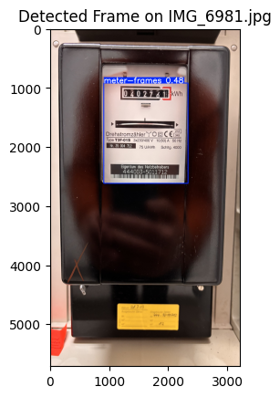

# Meter Reader

This project offers a robust, albeit unconventional, solution for tracking electricity consumption within a home automation setup. While simpler methods exist, this project demonstrates how to integrate various technologies in a homelab environment for a more engaging and educational experience.

## Use Case

Home Assistant's energy dashboard provides a convenient way to monitor electricity usage. This typically involves smart meters, API calls to utility providers, or AI-powered edge devices that analyze meter images. However, for those seeking a less conventional approach, this project provides an alternative.

This application captures an image of an electricity meter (e.g., using a smartphone), processes it to extract the meter reading, and publishes the data to an MQTT queue for Home Assistant to consume. This allows for periodic updates of electricity consumption on the energy dashboard.

## Architecture

The project comprises several components:

### Server (server.py)

* Implements a Quart web server to handle image uploads.
* Provides a frontend for visualizing processed images (primarily for debugging image detection models).

### Predicter (predicter.py)

* The core of the project, responsible for image analysis.
* Employs three re-trained YOLOv8 models in a "divide and conquer" strategy:
    1. **Frame Detection:** Isolates the meter frame within the image.
    2. **Counter Detection:** Locates the counter display within the frame.
    3. **Digit Extraction:** Extracts individual digits and determines the meter reading.

### Helper Modules

* **config.py:** Reads configuration parameters from `config.yaml`.
* **custom_logger.py:** Defines logging behavior and stores logs in the `log` directory.
* **mongodb_handler.py:**  Provides an optional interface for storing image processing data in a MongoDB database.
* **mqtt_client.py:** Manages communication with Home Assistant via MQTT.
* **render-yaml.py:** Generates Home Assistant MQTT device configurations using Jinja2 templates.

### Deployment

The application is designed for deployment in a Docker container using `Dockerfile` and `docker-compose.yml`.

## Model Training

The `trainer.ipynb` notebook contains the code for training the YOLOv8 models used by the predictor. Refer to [README_PredictionModels](./docs/README_PredictionModels.md) for further details. Trained model weights should be placed in the designated `weights` directory (or as specified in `config.yaml`).

## Web Interface

The `static` and `templates` directories contain the files used by `server.py` to render the web interface.

## Image Detection Process

Inspired by [OpenCV practice: OCR for the electricity meter](https://en.kompf.de/cplus/emeocv.html), this project utilizes a three-stage image detection process to extract the meter reading. Instead of relying solely on OCR, which can be prone to errors, it employs a more robust approach:

1. **Frame Detection:**

   

2. **Counter Detection:**

   

3. **Digit Extraction:**

   

This "divide and conquer" strategy simplifies the image processing pipeline and improves accuracy.

**Example Result:**

Final Meter Value: 40276

## Contributing

Contributions are welcome! Please feel free to open issues for bug reports or feature requests. Pull requests for code improvements and bug fixes are greatly appreciated.

## License

This project is licensed under the The Unlicense - see the [LICENSE](LICENSE) file for details.