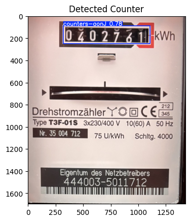

# Meter Reader

This is a scipt along the lines of all roads lead to Rome!

It's a complex solution to a simple problem. However, it is done to show how various pieces of technology can be used in a homelab to do some cool things.

## Brief use case description
To track the electricity consumption, [Home Assistant](https://homeassistant.io) provides an [energy dashboard](https://www.home-assistant.io/docs/energy/). The electricity consumption can be tracked using smart meters, by calling an API of your utility, or even with some clever implementations like [AI-on-the-edge-device](https://github.com/jomjol/AI-on-the-edge-device) that monitor the consumption by taking photos of the counter.

In my opinion this accuracy is not needed, it's enough to sporadically note the consumption. 

This is where this script comes in. Why do it easy, when you can solve it with a complex solution! It's like cracking a walnut with a sledgehammer. (DE: mit Kanonen auf Spatzen schießen)

This Application takes a photo of the Electricity Meter taken,e.g. by a smartphone, and sent to the app using the upload function `http://<your app URL>>/file` (if using an iPhone, the shortcut `so_75xxx.shortcut` can be used), the upload function applies image detection to extract the meter value, before placing it on an MQTT-Queue for Home Assistant to process it and update the electricity consumption on the energy dashboard.

## Components

### Server.py
This script implem,ents a quart web server to, whose main purpose is to handle the upload of the image. It is also a frontend showing the files that have been processed (mainly for debugging the image detection models)

### Predicter
The main script here is `predicter.py`this is the cow of the project. It takes the image and uses re-trained [YOLO 11p](https://docs.ultralytics.com/models/yolo11/) models to find the actual value, using three models (divide and conquer pattern):
1. Find the frame with the counter
2. Find the Counter itself
3. Extract the digits, and determine the actual value

`predict_helper.py` defines various helper functions

### Other Helpers 

- `config.py` reads the config.ymal file, and nakes the config variables avilable to the rest of the application

- `custom_logger.py` defines the logging parameters, including a separate logger stored in the `log` directory for easy access

- `mongodb_handler.py`implements a handler to store information about processed imagaes in a MongoDB Database. This is not really needed, but is a nice exercise in using theMongoDB from a Python script.

- `mqtt_client.py` implements a mqtt client to manage the Home Assistant [MQTT based integration](https://www.home-assistant.io/integrations/mqtt/) 

- `render-ymal.py` a small script that renders a Home Assistant MQTT Device configuration using JINJA2 templates. Makes it easier to create the device defintion templates 

### Docker
The script is deployed in a Docker container using `Dockerfile` and `docker-compase.yml`

## Notebooks / Training the Models

`trainer.ipynb` contains the code that acruall trains the YOLO11 models used by the predicter. See [README_PredictonModels](./docs/README_PredictionModels.md)

THe resulting weights need to be moved to the weights directory, or whereever a specified in `config.yaml`

## Web Page
the `static`and `tempates`directories contain the files used by `server.py` to render the web page

# Image Detection Process
The detation of the value of the electricity meter is done using three different model, to simplify the detection (each model is small enough to allow three t be loaded at the same time). This simplifies the algorithm, as there is hardly any image manipulation required. Inspriration comes from [OpenCV practice: OCR for the electricity meter](https://en.kompf.de/cplus/emeocv.html). However, the use of OCR did not give the expected results.

The idea here is to "divide and conquer". I.e. to desect the image in three simple steps, where each step will isolate a part of the image. Each part is big enough so the model will be simple and quick.

### The Frame

### The counter

### The digits

### Resulting Value

Final Meter Value: 40276

