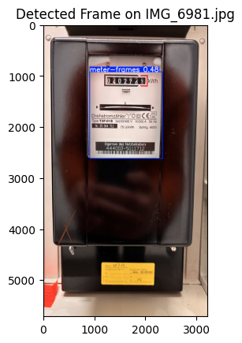

# Electricity Meter Reading Pipeline - Stage 1: Meter Area Detection

This stage focuses on training a YOLOv11 model to detect the rectangular area of the electricity meter that contains the counter.

**Dataset**

* Collected images of electricity meters in various conditions (lighting, angles, distances).
* Annotated the images using Roboflow, drawing bounding boxes tightly around the white rectangular area containing the counter.
* Used Roboflow's "Fill (black edges) in" resize option to create 640x640 training images while preserving aspect ratio.

**Model Training**

* Used a pre-trained YOLOv11n model (`yolo11n.pt`) as the basis.
* Trained the model on the annotated dataset using Ultralytics library in a Jupyter Notebook environment.
* Monitored training progress with TensorBoard.
* Achieved high precision, recall, and mAP scores on the validation set.

**Output**

* A trained YOLOv11n model capable of accurately detecting the meter area in images.
* This model is used to crop the relevant region from the original images for Stage 2.

### Example detection - The Frame

