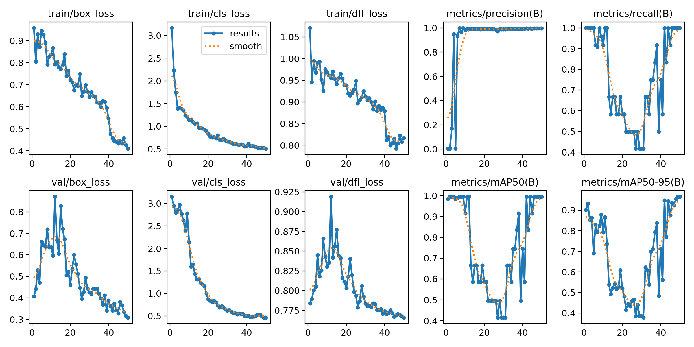
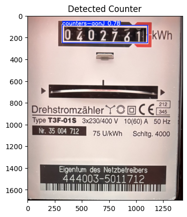

# Electricity Meter Reading Pipeline - Stage 2: Counter Area Detection

This stage focuses on training a YOLOv11 model to detect the counter area within the cropped images from Stage 1.

**Dataset**

* Used the Stage 1 model to crop the meter area from the original images.
* Annotated the cropped images, drawing bounding boxes around the counter area (including the black border for context).
* Resized the cropped images to 640x640 using "Fill (black edges) in" to maintain consistency.

**Model Training**

* Used a pre-trained YOLOv11n model (`yolo11n.pt`) as the basis.
* Trained the model on the annotated cropped images using Ultralytics library.
* Addressed NMS warnings by increasing the `--nms-time-limit`.
* Achieved high precision, recall, and mAP scores on the validation set.

**Output**

* A trained YOLOv11n model capable of accurately detecting the counter area within the cropped images.
* This model is used to further refine the region of interest for digit segmentation in Stage 3.
* Training results:

### Example Detection - The counter

