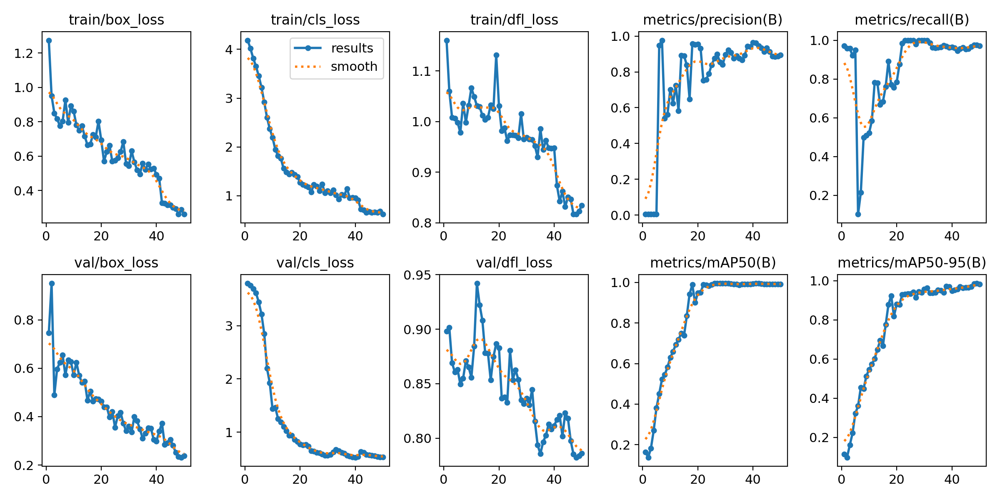

# Electricity Meter Reading Pipeline - Stage 3: Digit Recognition

This document describes the process for training a digit recognition model as part of an electricity meter reading pipeline.

## Preprocessing

The following steps are involved in preprocessing the images of the electricity meter counter:

1. **Input:** Take the output of Stage 2, which is an image of the counter area cropped from the original image.
2. **Straighten:** Use horizontal line detection (e.g., Hough Line Transform) to estimate the rotation angle and straighten the image. This ensures proper digit alignment.
3. **Convert to Binary:**
   - Convert the image to grayscale.
   - Apply binary thresholding to create a black and white (B/W) image.
   - Invert the binary image to make the digits white and the background black.
4. **Remove Borders:** Use horizontal line detection to identify and remove any remaining borders above and below the digits. This can be achieved using techniques like inpainting or morphological operations.
5. **Isolate Digits:** Apply edge detection (e.g., Canny edge detector) to identify the boundaries of the digits.
6. **Filter Contours:** Filter the resulting contours (detected digit boundaries) based on criteria such as:
   - Height > Width (digits are usually taller than they are wide)
   - Area (height * width) > threshold (to eliminate small noise or artifacts)
   - Other conditions as needed (e.g., aspect ratio, solidity)
7. **Extract and Save:** Extract each segmented digit and save it as a separate image file.

## Annotation

1. **Labeling UI:** Use a dedicated script with a user interface (UI) to display each digit image and allow the user to enter its corresponding value (0-9).
2. **YOLO Format:** Save the annotation data in YOLO format, which includes:
   - A `.txt` label file for each image.
   - Each line in the file represents a digit with the format: `<class_id> <x_center> <y_center> <width> <height>`.
   - `class_id`: The digit value (0-9).
   - `x_center`, `y_center`, `width`, `height`: Normalized bounding box coordinates of the digit within the image.

## Training

1. **Model Selection:** Choose a suitable model architecture for digit recognition. A Convolutional Neural Network (CNN) is commonly used for this task. Consider architectures like:
   - LeNet-5
   - A simple custom CNN
   - Transfer learning from a pre-trained model (e.g., MobileNet, ResNet)
2. **Dataset Preparation:** Organize the dataset of segmented digit images and their corresponding YOLO format label files.
3. **Training Script:** Write a training script that:
   - Loads the dataset.
   - Initializes the chosen CNN model.
   - Defines the optimizer, loss function, and other hyperparameters.
   - Trains the model on the dataset.
   - Validates the model's performance on a separate validation set.
   - Saves the trained model weights for later use.

## Evaluation

1. **Test Set:** Evaluate the trained digit recognition model on a held-out test set to assess its generalization performance.
2. **Metrics:** Use appropriate metrics to measure the model's accuracy, such as:
   - Accuracy (percentage of correctly classified digits)
   - Precision, Recall, F1-score
   - Confusion matrix (to analyze misclassifications)

## Integration

1. **Pipeline Integration:** Integrate the trained digit recognition model into the overall electricity meter reading pipeline.
2. **Output:** Combine the recognized digits to construct the final meter reading value.

## Further Improvements

* **Data Augmentation:** Apply data augmentation techniques to increase the size and diversity of the training dataset.
* **Hyperparameter Tuning:** Experiment with different model architectures, hyperparameters, and optimization strategies to improve performance.
* **Error Analysis:** Analyze the model's errors and misclassifications to identify areas for improvement in the preprocessing, annotation, or training process.

* **Training results** :

_preliminary model_

### Example Detection: The digits

