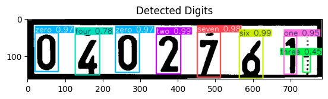

# Electricity Meter Reading Pipeline - Stage 3: Detect individual digits

This stage focuses on training a YOLOv11 model to detect the individual digits on the image from stage 2 and to calculate the resulting value.

**Dataset**

* Used the Stage 2 model to crop the meter area from the frame image returned by stage 1
* Initially create a rudimentary model to detect individual digits, 
* Annotated the cropped images, drawing bounding boxes around the counter area (including the black border for context).
* Resized the cropped images to 256x256 using "Fill (black edges) in" to maintain consistency.

**Model Training**

* Used a pre-trained YOLOv11n model (`yolo11n.pt`) as the basis.
* Trained the model on the annotated cropped images using Ultralytics library.
* Addressed NMS warnings by increasing the `--nms-time-limit`.
* Achieved high precision, recall, and mAP scores on the validation set.

**Output**

* A trained YOLOv11n model capable of accurately detecting the individual digits of the image.
* for the returned detection, select the ones that seem to be digits, based on a simple condition:

` height > width` and `area (height * width > 200)`

sort the selected bonding boxes by the `x1` coordinate to get the digits in the right order, 

* Training results:

### Example Detection - The digits

